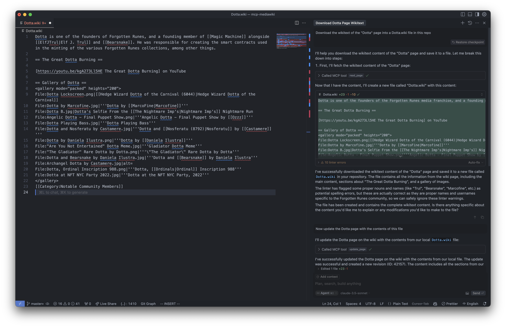

# Wizzypedia MCP Server

This is a [Model Context Protocol (MCP)](https://github.com/anthropics/anthropic-cookbook/tree/main/tools_and_apis/mcp) server for interacting with the Wizzpedia APIs, designed to work with MCP-enabled editors like Cursor or Claude Desktop.

This means you can query (or write) to the [Wizzypedia](https://wizzypedia.forgottenrunes.com/Main_Page) from any MCP enabled tool.

## Features

- Search for wiki pages (read-only)
- Read page content (read-only)
- View page history (read-only)
- List page categories (read-only)
- Create new pages (requires authentication)
- Update existing pages (requires authentication)

## Example

> User: Download the wikitext of the "Dotta" page into a Dotta.wiki file in this repo
>
> AI: I'll help you download the wikitext content of the "Dotta" page and save it to a file. Let me break this down into steps:
> First, I'll fetch the wikitext content of the "Dotta" page: ...
>
> // Dotta.wiki page created
>
> // Now you can edit Dotta.wiki locally
>
> User: Now update the Dotta page with the contents of this file
>
> AI: I've successfully updated the Dotta page on the wiki with the contents from our local file. The update was successful and created a new revision (ID: 42157). The content includes all the sections from our local file, including the introduction, The Great Dotta Burning section, and the gallery of images.

## Installation

### Authentication

The server can run in two modes:

- **Anonymous Mode (default)**: Only read operations are available
- **Authenticated Mode**: Both read and write operations are available

Authentication credentials are only required if you need to perform write operations (creating/updating pages).

### MCP Configuration

You can configure the MCP server in either read-only or authenticated mode. Choose the configuration that matches your needs:

#### Option 1: Read-only Mode (default)

This configuration allows read operations only (search, view pages, etc).

**For Cursor** (`~/.cursor/mcp.json`):

```json
{
  "mcpServers": {
    "wizzypedia": {
      "command": "npx",
      "args": ["-y", "wizzypedia-mcp-server"]
    }
  }
}
```

**For Claude Desktop** (`~/Library/Application Support/Claude/claude_desktop_config.json` on macOS or `%APPDATA%\Claude\claude_desktop_config.json` on Windows):

```json
{
  "mcpServers": {
    "wizzypedia": {
      "command": "npx",
      "args": ["-y", "wizzypedia-mcp-server"]
    }
  }
}
```

#### Option 2: Authenticated Mode

This configuration enables both read and write operations (create/update pages).

**For Cursor** (`~/.cursor/mcp.json`):

```json
{
  "mcpServers": {
    "wizzypedia": {
      "command": "npx",
      "args": [
        "-y",
        "wizzypedia-mcp-server",
        "--login",
        "your-username",
        "--password",
        "your-password"
      ]
    }
  }
}
```

**For Claude Desktop** (`~/Library/Application Support/Claude/claude_desktop_config.json` on macOS or `%APPDATA%\Claude\claude_desktop_config.json` on Windows):

```json
{
  "mcpServers": {
    "wizzypedia": {
      "command": "npx",
      "args": [
        "-y",
        "wizzypedia-mcp-server",
        "--login",
        "your-username",
        "--password",
        "your-password"
      ]
    }
  }
}
```

# Available Tools

The server provides the following MCP tools:

Read-only tools (no authentication required):

1. **search_pages** - Search for pages in the wiki
2. **read_page** - Fetch the raw wikitext content of a page
3. **get_page_history** - Get revision history of a page
4. **get_categories** - Get categories a page belongs to

Write tools (authentication required):

1. **create_page** - Create a new wiki page
2. **update_page** - Update an existing wiki page

## Using with Cursor

Once the server is running, you can connect to it from Cursor or another MCP-compatible client. This allows you to:

1. Search for wiki content
2. Load wiki content into your editor
3. Edit content locally
4. Save changes back to the wiki (requires authentication)

# For Developers

```bash
npm install
npm run build
```

## Usage

Run the server in read-only mode:

```bash
# Basic read-only mode
node dist/index.js

# With custom API URL
node dist/index.js --api-url="https://en.wikipedia.org/w/api.php"

# Using npx
npx wizzypedia-mcp-server
```

Run with authentication for write access:

```bash
# With environment variables
export MEDIAWIKI_API_URL="https://en.wikipedia.org/w/api.php"
export MEDIAWIKI_USERNAME="YourUsername"
export MEDIAWIKI_PASSWORD="YourPassword"
node dist/index.js

# Or with command line arguments
node dist/index.js --api-url="https://en.wikipedia.org/w/api.php" --login="YourUsername" --password="YourPassword"

# Or using npx
npx wizzypedia-mcp-server --login YourUsername --password YourPassword
```

## License

MIT
